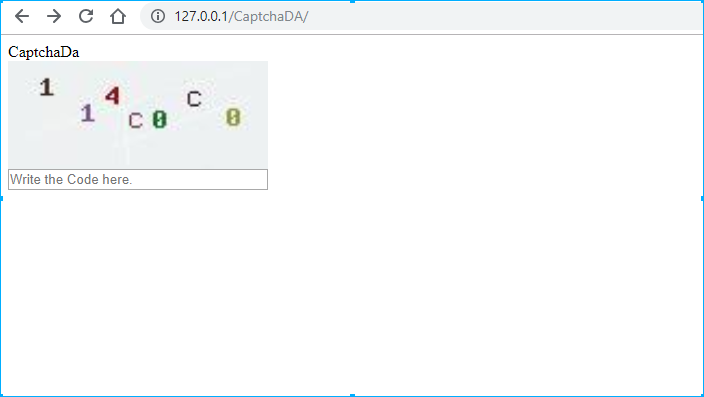

# CaptchaDa

## Presentation

Haha, i know, that look useless for most of people getting there, because of all current systems already available across the web who have this feature, such as the **ReCaptcha of google**, but i wanted to made Mine, *Any libraries/framework/API/EndPoint needed*! A from scratch system of captcha to protectyour web pages and your forms!
This is the Captcha i used on my project [AntiDDOS-System](https://github.com/sanix-darker/antiddos-system).

## How to use it

CaptchaDa have 2 modes:

- You can get only the image of the captcha:
    You just need to call CaptchaDa.php as a source file 
    Ex: 
    ```html
        
    ```
    or
- You can get the complete form verification by requesting and pass the parameter _?getbox=_

Of course, in the server, you have the current $_SESSION Code value to compare with what the user enter:
```php
    // The generated code is saved in this current variable
    $_SESSION['CAPTCHADA'] = $code;
```

## How it's works

CaptchaDa use the *GD* library in PHP to generate and image of caracter in randomly colors and position, so that it will be completly difficult for robots to pass forms.

## Rendering



## Author

- [Sanix-darker](https://github.com/sanix-darker)